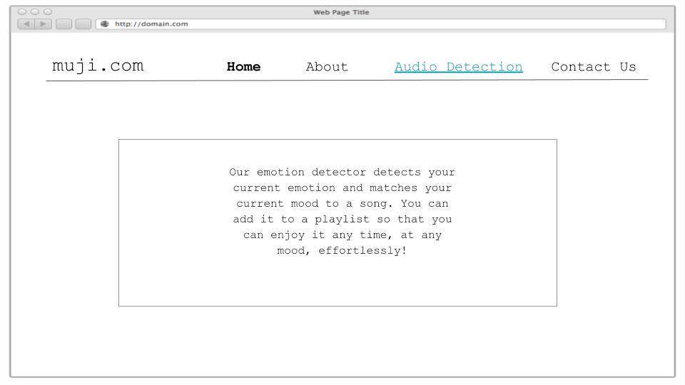
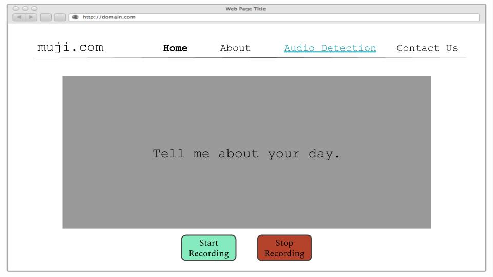
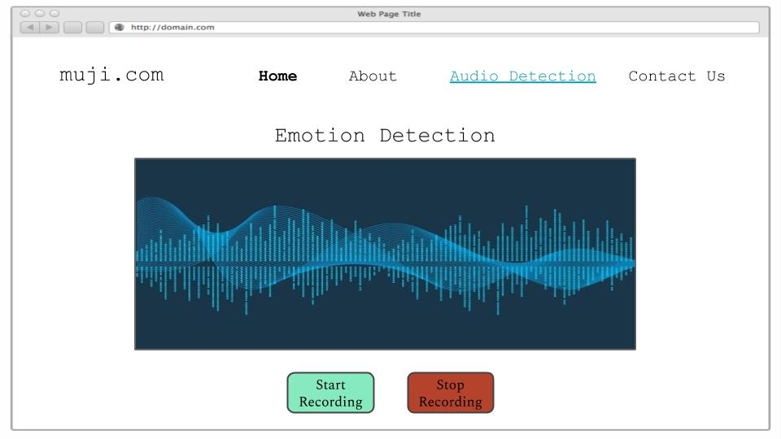
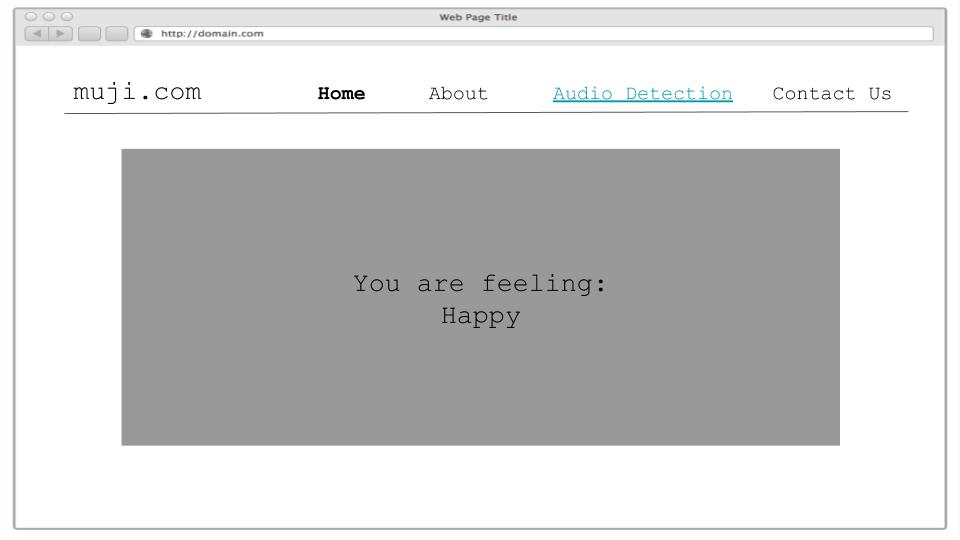
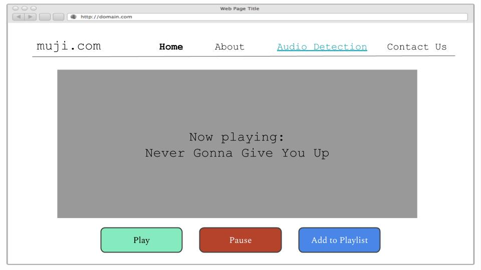

# comp20-f2018-team3

Project Title: 
* MuJi

Problem Statement (i.e., what is the problem?)
* Music has great impact on our emotions. It can help uplift us when we are 
  down, or get us motivated when feeling lazy. However, it's a hassle and 
  time-consuming to create new playlists for different moods. It's even more
  time-consuming to search for an appropriate playlist that matches your mood. 

How do you solve the problem?
* Our solution involves an emotion detector that detects the user's current
  emotion (through audio--what the user says) and matches that to an 
  appropriate playlist. Now, the user can enjoy a good playlist at any time,
  in any mood, effortlessly!

List of all the features that your team will implement. Your team will 
be held accountable for the featurs you list!
* Recognizes emotions through audio--what the user says
* Automatically picks songs according to your emotion and plays them 
* User will have the option of saving the played song into a certain playlist 

What data will your prototype be using and collecting?
* We'll be using the data from the user (their response to "How was your day?") 
* We'll also be using songs from Spotify API with extra information that 
* represents the properties of the song (i.e. dancability, energy, liveness, etc.)

Any algorithms or special techniques that will be necessary.
* We'll be using sentiment analysis through Google's API to determine the emotion
  based on user's response (their audio response). 
* We will provide user with all universal emotions and their corresponding 
  calculated percentage of how much of that emotion is present. 
* We'll use the data we get from user's response and create our algorithm to 
  present the most relevant songs to user's emotion. Their song selection 
  will be taken into account (whether they choose to skip the song or not).

Electronic mockups of what your team will be developing using wireframes. No
hand-drawn mockups accepted. 

 

 

 

 

 

If your team incorporates hardware into the project, a high-level system
engineering diagram will be ideal. A high-level system engineering diagram
contains all the compoments of the system (e.g., router, sensors, boards, 
other hardware), how the components connect to other components, and inputs 
and outputs (including data). Wireframes should still be used for system 
engineering diagram. Wireframes of front-end web interfaces are still required.
